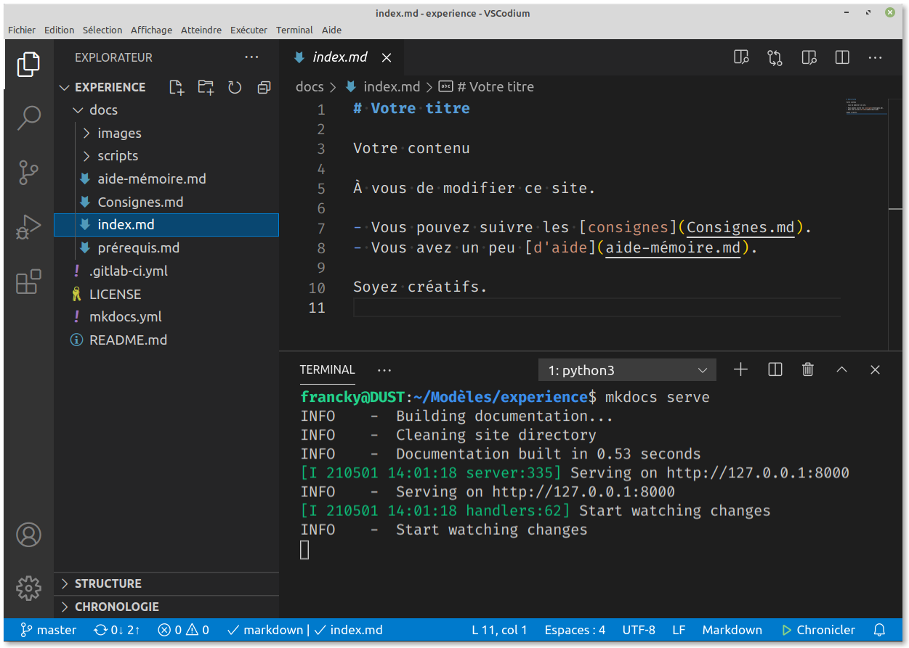

# Première expérience

!!! faq "Avez-vous les bons outils ?"
    - [ ] Un explorateur de fichiers.
    - [ ] Un émulateur de terminal (ou ligne de commande).
    - [ ] Un outil pour décompresser les archives `.zip`.
    - [ ] un éditeur de code.
    - [ ] _Material for MkDocs_ installé.

    Alors ?

    - Non ; vous pouvez trouver [les bons outils](prérequis.md).
    - Oui ; vous pouvez continuer.

    Dans la suite on utilisera VSCodium en démonstration, mais
    toute autre combinaison d'outils est possible.

## Préparation du projet

1. [Télécharger **ce** projet](https://gitlab.com/ens-fr/experience/-/archive/master/experience-master.zip){ .md-button } ; oui, vous allez modifier ce site-là !
2. Extraire ce fichier `.zip` dans un dossier, dans vos `Modèles`, par exemple. Vous pouvez renommer `experience-master` en `experience` ou tout autre nom.
3. Lancer VSCodium, puis avec ++ctrl+k+o++ ouvrir le dossier `experience` là où vous l'avez décompressée.
4. Ouvrir un terminal dans VSCodium (Affic<u>h</u>age → <u>T</u>erminal) avec ++alt+h++ puis ++t++.
5. Dans le terminal entrer `mkdocs serve`.
6. Ouvrir votre navigateur à l'adresse <http://127.0.0.1:8000>
7. Cliquer sur le fichier :material-arrow-down-bold: `index.md`

## Vérification

Vous devriez avoir une situation qui ressemble à 

Si vous avez une erreur, vérifiez que vous êtes bien dans le bon répertoire pour votre terminal.

## Consignes

Vous pouvez modifier le fichier `index.md`. À chaque sauvegarde, votre navigateur sera mis à jour automatiquement.

Vous pouvez fermer la fenêtre du terminal, et en cas de doute, vous pourrez aller la consulter avec ++alt+h+t++. Le terminal indique certains avertissements ou des erreurs. Il faut relancer `mkdocs serve` en cas d'erreurs. Pour le stopper, cliquer dessus et entrer ++ctrl+c++.

Une fois votre page créée (une seule page pour commencer), vous pouvez utiliser votre explorateur de fichier, et avec un clic droit sur votre dossier `experience` vous pouvez compresser tout le dossier en une archive `.zip`. Archive que vous pouvez transmettre pour montrer votre travail. Nous verrons plus tard comment héberger votre site en ligne facilement.
